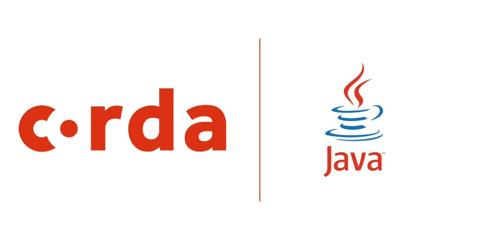

# Corda5 Java Samples

<p align="center">
  
</p>

All CorDapp samples are written in duo coding languages to accommodate our vast audience of app developers out there.
This is the Java Samples folder.

## Folder Structure
```
.
├── README.md
├── corda5-obligation-cordapp
├── encumbrance-pawn-shop
├── ping-pong
└── referencestates-sanctionsbody
```

