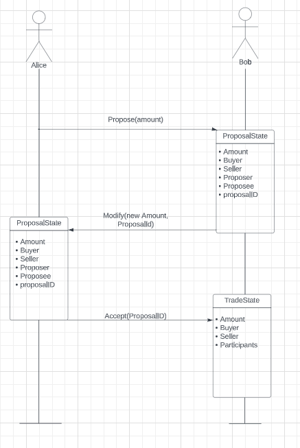
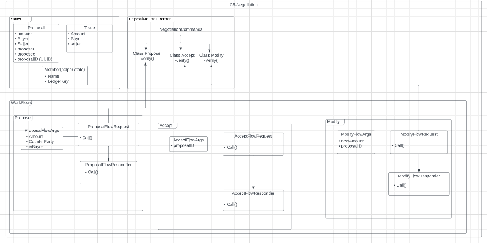

# Negotiation Cordapp

This CorDapp shows how multi-party negotiation is handled on the Corda ledger, in the absence of an API for user
interaction.

## Concepts
A flow is provided that allows a node to propose a trade to a counterparty. The counterparty has two options:

* Accepting the proposal, converting the `ProposalState` into a `TradeState` with identical attributes
* Modifying the proposal, consuming the existing `ProposalState` and replacing it with a new `ProposalState` for a new
  amount

Only the recipient of the proposal has the ability to accept it or modify it. If the sender of the proposal tries to
accept or modify the proposal, this attempt will be rejected automatically at the flow level. Similarly, the modifier 
cannot accept the modified proposal. 

### Flows
We start with the proposal flow implemented in `ProposalFlowRequest.java`.

The modification of the proposal is implemented in `ModifyFlowRequest.java`.

In the `AcceptFlowRequest.java`, we receive the modified or unmodified ProposalState and it is converted into a 
TradeState.

### Setting up

1. We begin our test deployment with clicking the `startCorda`. This task loads up the combined Corda workers in Docker.
   A successful deployment will allow you to open the REST APIs at: https://localhost:8888/api/v1/swagger#. You can test 
   out some functions to check connectivity. (GET /cpi function call should return an empty list as for now.)
2. We now deploy the CorDapp with a click of `5-vNodeSetup` task. Upon successful deployment of the CPI, the GET /cpi 
   function call returns the metadata of the CPI you just upload.

### Running the CorDapp
In Corda 5, flows are triggered via `POST /flow/{holdingidentityshorthash}` and flow result has to be viewed at 
`GET /flow/{holdingidentityshorthash}/{clientrequestid}`
* holdingidentityshorthash: the ID of the network participants, i.e. Bob, Alice, Charlie. You can view all the short 
  hashes of the network member with another Gradle task called `ListVNodes`
* clientrequestid: the ID you specify in the flow request body when you trigger a flow.

#### Step 1: Create Proposal state between two parties
Pick a VNode identity to initiate the Proposal state creation and get its short hash. For example, let's pick Alice:

Go to `POST /flow/{holdingidentityshorthash}`, enter Alice's identity short hash and the following request body:
```
{
  "clientRequestId": "createProposal",
  "flowClassName": "com.r3.developers.samples.negotiation.workflows.propose.ProposalFlowRequest",
  "requestBody": {
      "amount": 20,
      "counterParty":"CN=Bob, OU=Test Dept, O=R3, L=London, C=GB"
  }
}
```
After triggering the create-ProposalFlow, hop to `GET /flow/{holdingidentityshorthash}/{clientrequestid}` and enter 
Alice's identity short hash and client request ID ("createProposal" in the case above) to view the flow result.

#### Step 2: List created Proposal state
In order to continue the CorDapp's logics, we need the Proposal ID - the identity of the created Proposal state. This 
step will bring out all the Proposal this entity (Alice) has.
Go to `POST /flow/{holdingidentityshorthash}`, enter the Alice's identity short hash and request body:
```
{
    "clientRequestId": "list-1",
    "flowClassName": "com.r3.developers.samples.negotiation.workflows.util.ListProposal",
    "requestBody": {}
}
```
After triggering the List Proposal, hop to `GET /flow/{holdingidentityshorthash}/{clientrequestid}` and enter Alice's 
identity short hash and client request id ("list-1" in the case above) to view the flow result.

#### Step 3: Modify the proposal 
The responder, Bob, can edit the proposal if required by entering the new amount. 
Go to `POST /flow/{holdingidentityshorthash}`, enter Bob's identity short hash and request body:
```
{
  "clientRequestId": "ModifyFlow",
  "flowClassName": "com.r3.developers.samples.negotiation.workflows.modify.ModifyFlowRequest",
  "requestBody": {
      "newAmount": 22,
      "proposalID": "<use the proposal id here>"
  }
}
```
After triggering the modify flow, we need to hop to `GET /flow/{holdingidentityshorthash}/{clientrequestid}` and 
check the result. Enter Bob's hash id and the modify flow ID which is "ModifyFlow" in the case above.

#### Step 4: Accept the new proposal from bob  `AcceptFlow`
In this step, Alice will accept the new proposal from Bob.
Goto `POST /flow/{holdingidentityshorthash}`, enter Alice's identity short hash and request body, we also need to 
provide the proposalId, which is same as the proposal ID used in ModifyFlow body. 
```
{
  "clientRequestId": "AcceptFlow",
  "flowClassName": "com.r3.developers.samples.negotiation.workflows.accept.AcceptFlowRequest",
  "requestBody": {
      "proposalID": "<use the proposal id here>"
  }
}
```
And as for the result of this flow, go to `GET /flow/{holdingidentityshorthash}/{clientrequestid}` and enter the 
required fields.

Thus, we have concluded a full run through of the Negotiation app.

### App Diagrams
Below are the app diagrams which are useful for the visual understanding.

#### Dynamic Diagram



#### Static Diagram




