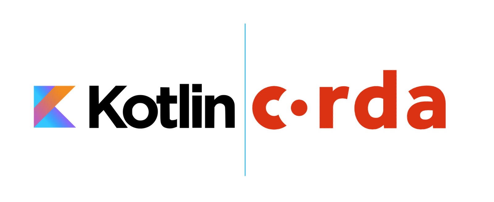

# Corda5 Kotlin Samples

<p align="center">
  
</p>

All CorDapp samples are written in duo coding languages to accommodate our vast audience of app developers out there. 
This is the Kotlin Samples folder. 

## Folder Structure
```
.
├── README.md
├── corda5-obligation-cordapp
└── mgm-dynamic-network
```

