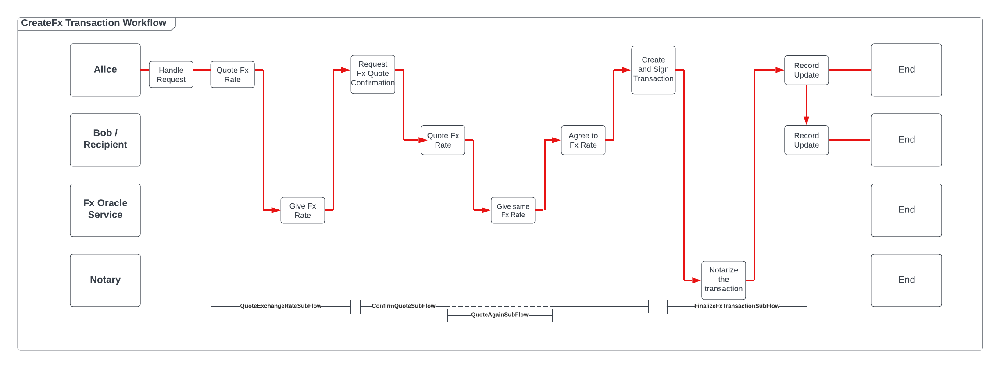

# Foreign Exchange
In this app, you can trigger the `CreateFxTransaction` client-sided workflow to request the creation of a Foreign Exchange 
transaction from one currency to another with any other member vNode within the network.

This CorDapp demonstrates the implementation of Oracle Services in Corda 5.

## About this sample

The following diagram illustrates the logic of the CreateFxTransaction workflow which instructs the CorDapp to create foreign exchange
transactions. In this example let us use `Alice` as the initiator and `Bob` as the recipient:



- The flow starts with `Alice` interpreting the request that triggered the flow.
- Then, `Alice` executes the `QuoteExchangeRateSubFlow` to request a conversion rate from the `Fx Oracle Service` given the inputs.
- The oracle service responds by returning the correct conversion rate.
- Next, `Alice` executes the `ConfirmQuoteSubFlow` to request `Bob` to confirm if the conversion rate is correct from its perspective.
- Within the SubFlow, `Bob` executes the `QuoteAgainSubFlow` to communicate to the `Fx Oracle service` for a conversion rate
independently from `Alice`.
- The `Fx Oracle Service` responds to `Bob` the same conversion rate.
- Once, `Bob` is satisfied with equality of the proposed conversion rate, it responds to `Alice` with a confirmation
- Now that `Alice` and `Bob` both agree, `Alice` creates and signs a transaction detailing everything about the foreign exchange
- `Alice` sends the transaction to all relevant parties (the `Notary` and then `Bob`)
- The `Notary` notarizes the transaction and sends the fully signed transaction back to `Alice`, who sends it back to `Bob`
so that every node updates their record to include the new foreign exchange transaction

---
## Usage
### Setting Up
1. Start the sandbox environment by clicking the Gradle task `Tasks > csde-cordapp > startCorda`. 
   A successful deployment will allow you to open the REST APIs: https://localhost:8888/api/v1/swagger
2. Deploy the CorDapp by clicking `Tasks > csde-cordapp > 5-vNodesSetup`. When successful, you should be able to see the
CPI metadata of the CorDapp you deployed by calling the `GET /cpi/` endpoint.
3. Take note of the identity short hash of the `Alice` member node by either:
   1. looking at the output log of the run from the previous step OR 
   2. using the Gradle task `Tasks > csde-qeuries > listVNodes` to lists all the member nodes labeled with their identity
   short hashes

### Running the app
#### Getting ready to trigger the workflow to create a transaction
Please note that the following steps for running the app will use `Alice` as the initiator and  `Bob` as the recipient for
the transaction but feel free to use any other member node as the recipient. Just be sure to correctly include the correct 
'identity short hash' for the initiator and correct  'X500 Name' of the member node.

We trigger flows using the endpoint `POST /flow/{holdingidentityshorthash}` and obtain the flow result using the endpoint
`GET /flow/{holdingidentityshorthash}/{clientrequestid}`, where:
- `holdingidentityshorthash`: the id of the network participants that will initiate the initial client-startable workflow
- `clientrequestid`: the id you specify in the flow requestBody when you trigger a flow.

To trigger the correct flow, we need to identify the `flowClassName`, which can be obtained by calling the endpoint 
`GET /flowclass/{holdingidentityshorthash}`.

#### Triggering and Fetching the flow to create a Foreign Exchange Transaction
Now that we have all the necessary information let's initate our transaction flow!

To create the transaction, call `POST /flow/{holdingidentityshorthash}` using `Alice`'s identity hash and the following 
request body:
```json
{
    "clientRequestId": "create-fx-1",
    "flowClassName": "com.r3.developers.samples.fx.workflows.CreateFxTransaction",
    "requestBody": {
        "convertingFrom": "GBP",
        "convertingTo": "USD",
        "amount": 100,
        "recipientMemberName":"CN=Bob, OU=Test Dept, O=R3, L=London, C=GB"
    }
}
```

To view the results of the flow and obtain the transaction details specified by the implementation of the code, call
`GET /flow/{holdingidentityshorthash}/create-fx-1`. The response JSON should look like the following:
```json
{
    "holdingIdentityShortHash": "12C58A1CAF2A",
    "clientRequestId": "create-fx-1",
    "flowId": "1ec4c16c-618c-46bd-9f35-0d5c07fdbd09",
    "flowStatus": "COMPLETED",
    "flowResult": "The FX transaction of 100 GBP to USD (exchange rate = 1.27) amounting to 127.0 is SUCCESSFUL. | transaction:SHA-256D:D8B1AC29E23E175B2B79056756DDFA1C1DAF66FF958B7FC047BF8BAD0D588862",
    "flowError": null,
    "timestamp": "2023-08-01T06:55:00.000Z"
}
```

#### Closing down the CorDapp

Simply run the Gradle task `Tasks > csde-corda > stopCorda`

Alternatively you can run the following command from the terminal:
```
./gradlew stopCorda
```

This is because resources that were created from the previous `startCorda` Gradle task needs to be properly closed down.

----
### Constraints:
Please bear in mind the following restrictions for this CorDapp sample:
1. The supported currencies are: `[ GBP, EUR, USD, CAD ]`.
2. The requested transaction amount must be greater than 0.00 of any currency.
3. The conversion rates are hardcoded. Create external HTTP requests inside the sandbox environment merits its own sample.