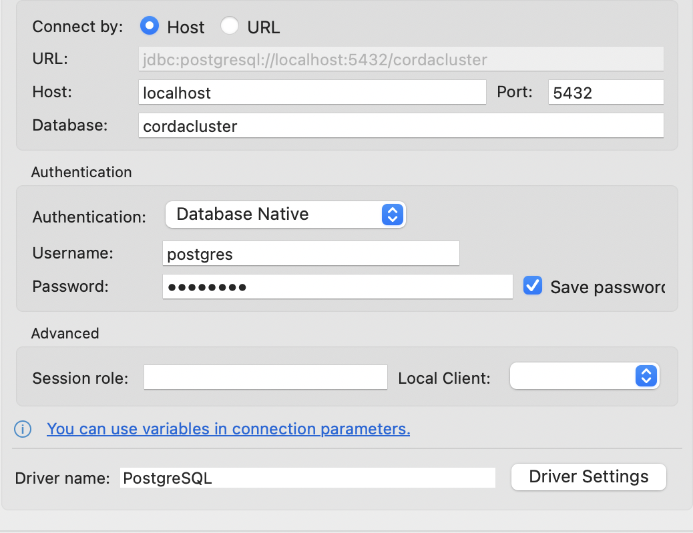
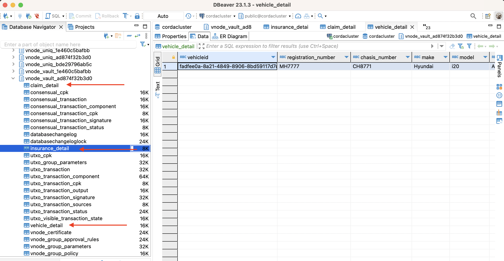

# Car Insurance -- Persistence

This CorDapp demonstrates how Persistence works in Next Gen Corda.
Corda allows developers to create custom schema to store state data separately, so that it can be used for other functionality
like reporting etc.

Unlike Corda 4, Next Gen Corda doesn't have the QueryableState functionality, however it exposes the Persistence Service which
can be used to achieve similar result.

In this CorDapp we would use an Insurance state and persist its properties in a custom table in the database.
The Insurance state among other fields also contains an VehicleDetail object, which is the asset being insured.
We have used this VehicleDetail to demonstrate One-to-One relationship.
Similarly, we also have a list of Claim objects in the Insurance state which represents claims made against the insurance.
We use them to demonstrate One-to-Many relationship.

### Entities
The entities for the custom tables are defined in the `contracts` module in the package `com.r3.developers.samples.persistence.schema`.
The corresponding liquibase scripts can be found in the `workflows` module under `resources/migration`.

### Flows

There are two flow in this CorDapp:

1. `IssueInsuranceFlow`: It creates the insurance state with the associated vehicle information.

2. `InsuranceClaimFlow`: It creates the claims against the insurance.

## Usage

### Setting up

1. We will begin our test deployment with clicking the `startCorda`. This task will load up the combined Corda workers in docker.
   A successful deployment will allow you to open the REST APIs at: https://localhost:8888/api/v1/swagger#. You can test out some
   functions to check connectivity. (GET /cpi function call should return an empty list as for now.)
2. We will now deploy the cordapp with a click of `5-vNodeSetup` task. Upon successful deployment of the CPI, the GET /cpi function call should now return the meta data of the cpi you just upload

### Running the app

In Corda 5, flows will be triggered via `POST /flow/{holdingidentityshorthash}` and flow result will need to be view at `GET /flow/{holdingidentityshorthash}/{clientrequestid}`
* holdingidentityshorthash: the id of the network participants, ie SanctionBody, Bob, Charlie and DodgyParty. You can view all the short hashes of the network member with another gradle task called `ListVNodes`
* clientrequestid: the id you specify in the flow requestBody when you trigger a flow.

### Running the flows

Pick Bob's VNode identity to issue the sanctions list
Go to `POST /flow/{holdingidentityshorthash}`, enter the identity short hash(Bob's hash) and request body:

      {
         "clientRequestId": "issue-1",
         "flowClassName": "com.r3.developers.samples.persistence.workflows.IssueInsuranceFlow",
         "requestBody": {
            "vehicleInfo": {
            "registrationNumber": "MH7777",
            "chasisNumber": "CH8771",
            "make": "Hyundai",
            "model": "i20",
            "variant": "Asta",
            "color": "grey",
            "fuelType": "Petrol"
            },
            "policyNumber" : "P001",
            "insuredValue": 500000,
            "duration": 2,
            "premium": 20000,
            "insuree": "CN=Charlie, OU=Test Dept, O=R3, L=London, C=GB"
         }
      }

This should create the insurance state and the state data should also have been persisted in the custom tables.

Now in order to add claims, Go to `POST /flow/{holdingidentityshorthash}`, enter the identity short hash(Charlie's hash) and request body:

      {
         "clientRequestId": "claim-1",
         "flowClassName": "com.r3.developers.samples.persistence.workflows.InsuranceClaimFlow",
         "requestBody": {
            "policyNumber" : "P001",
            "claimNumber": "CM001",
            "claimDescription": "Simple Claim",
            "claimAmount": 50000
         }
      }

This should add claims to the insurance and it can be viewed in the custom database tables.

### Connecting to the Database
To connect to the postgres database, you could use any db explorer of your choice.
Below image shows the connection details:

  

The password is `password`.

A schema would have been created for each vNode in the format: `vnode_vault_<identity_short_hash>`. The image
below highlights the custom tables created in the database.

  

